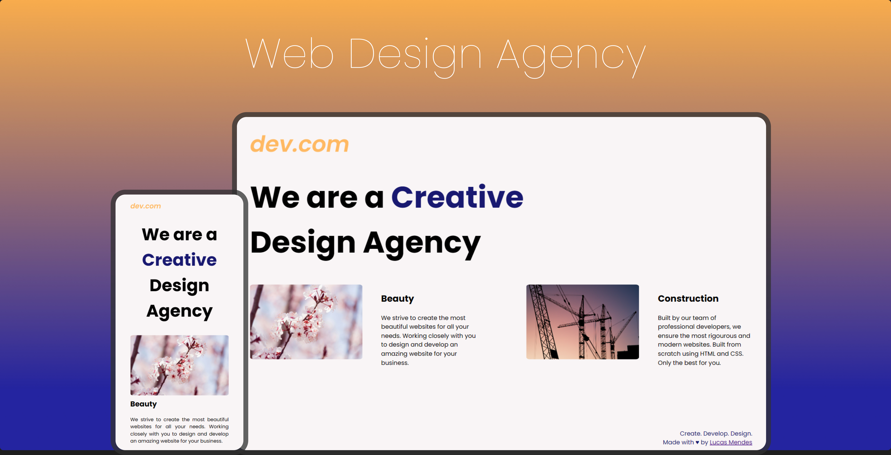

<h1 align="center"> WebDesignAgency </h1>

Repositório criado com o objetivo de conhecer mais sobre display e responsividade. 

  <a href="#-tecnologias">Tecnologias</a>&nbsp;&nbsp;&nbsp;|&nbsp;&nbsp;&nbsp;
  <a href="#-projeto">Projeto</a>

 

  

## 🌐 Tecnologias

Esse projeto foi desenvolvido utilizando as seguintes tecnologias:

- HTML
- CSS
- Git
- Github
- Figma

## 🔗 Projeto

A dev.com é uma agência de web design.

- [Acesse o projeto finalizado, online](https://lgm-mendes.github.io/web-design-agency)

---

 

  Feito com ♥ por Lucas Mendes 

